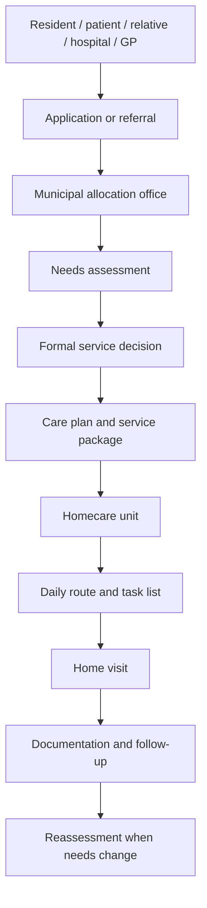
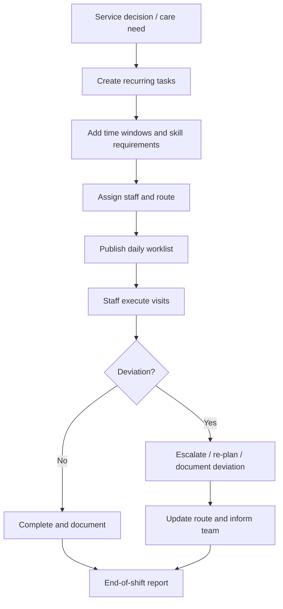
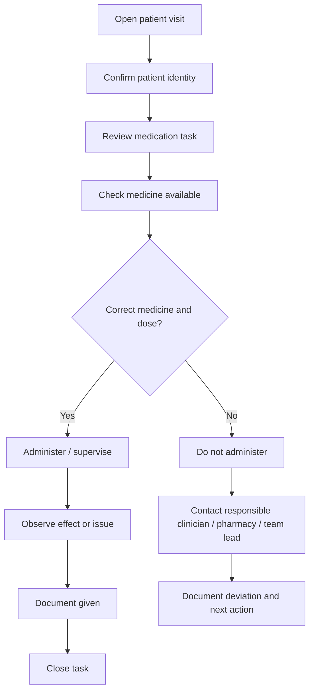
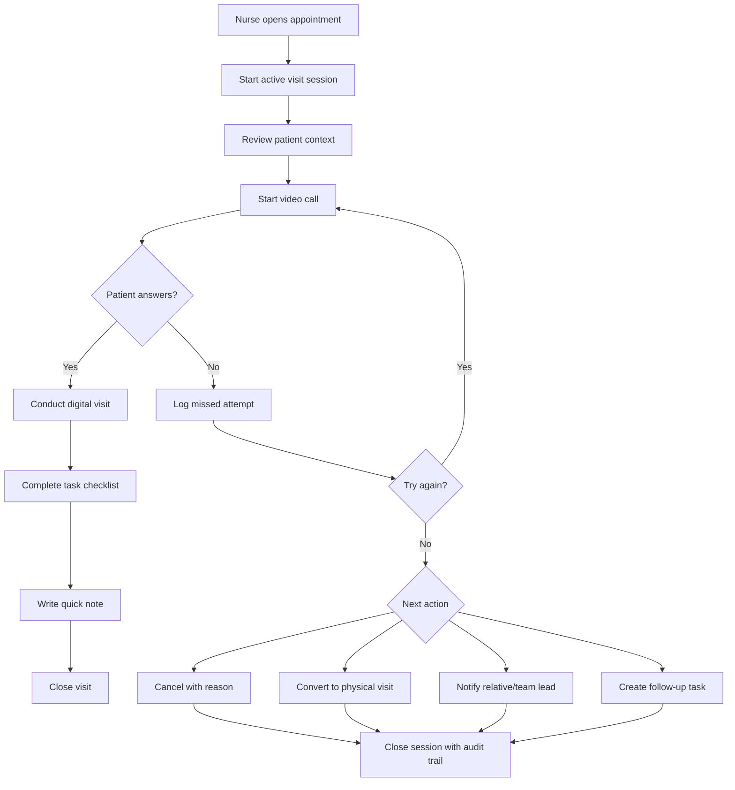
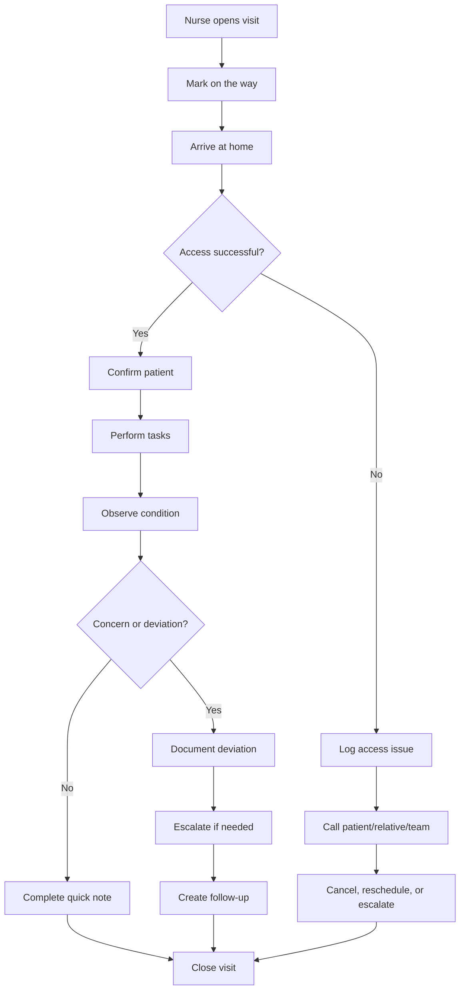

# Municipal Homecare Services in Norway and Europe

## Executive summary

Municipal homecare in Norway is a public, municipality-led service designed to help people live safely at home for as long as possible. The main operational provider is the municipality, not the county. Counties may still be relevant for adjacent services such as public dental care, while the Statsforvalter supervises legality, quality, and patient safety. In daily practice, homecare is delivered through a network of municipal allocation offices, homecare units, nurses, assistant nurses, GPs, hospitals, relatives, digital systems, and sometimes private contracted providers.

Norwegian homecare is usually based on formal municipal decisions. A person applies for or is referred to home-based services, the municipality assesses their needs, and the service is granted as a written decision. The decision often describes the type and amount of help the person should receive, for example home nursing, medication support, wound care, hygiene support, practical assistance, or follow-up after hospital discharge. These decisions are not always translated into exact national visit lengths. Instead, municipalities operationalise them locally through schedules, routes, task lists, and care plans.

The daily work of a homecare nurse is much broader than the visible home visit. A typical shift includes handover, route review, travel, medication rounds, wound care, personal care support, clinical observation, phone calls to GPs or relatives, documentation, deviation handling, reassessment, and end-of-shift reporting. For registered nurses, a large part of the workload is coordination and clinical judgement, not only hands-on care. Assistant nurses and aides often perform a larger share of routine direct care, depending on competence, delegation, and local routines.

Visit durations vary heavily by task complexity, geography, patient condition, and local staffing. Short medication visits may take around 5 to 15 minutes in the home, while personal care may take 15 to 45 minutes, and wound care or clinical assessment may take 20 to 60 minutes. However, the real operational cost of a visit also includes driving, parking, access to the home, preparation, mobile documentation, clarification calls, and possible escalation. A short visit can therefore create a much longer block of work.

Documentation is central to municipal homecare. Nurses and other health personnel must document what was planned, what was delivered, what they observed, what changed, what was not delivered, and what needs follow-up. Municipalities use electronic patient record systems, mobile devices, medication modules, scheduling systems, and national reporting structures. Even where digital systems are in place, staff may still experience fragmentation between the schedule, patient record, medication information, messaging, and reporting routines.

For ViKom, the main opportunity is not simply to build another documentation tool. The stronger product opportunity is to reduce fragmentation in the actual visit workflow: before the visit, during the visit, after the visit, and when something goes wrong. The app should support nurses as they move through a distributed, unpredictable workday. The most valuable product direction is a combined visit-support, communication, escalation, and documentation layer that makes it easier to complete safe care, communicate with patients and relatives, and leave an audit-ready trail without creating extra administrative work.

## 1. How municipal homecare is organised in Norway

Norwegian municipal homecare is part of the broader municipal health and care service. The municipality is responsible for ensuring that residents receive necessary health and care services. This includes home nursing, practical assistance, support for people with disabilities, rehabilitation-oriented services, welfare technology, and long-term support for older people living at home.

The municipality can provide these services directly through its own employees, or it can use private providers under municipal contract. Even when private providers are involved, the municipality remains responsible for ensuring that the service is safe, lawful, and adequate.

The typical organisational structure looks like this:

### Main stakeholders

| Stakeholder | Role in homecare |
|---|---|
| Municipality | Main organiser, funder, allocator, and often provider of homecare services. |
| Allocation office / service office | Assesses needs, grants services, writes formal decisions, and adjusts service scope. |
| Homecare unit | Delivers daily visits, plans routes, handles staffing, performs care tasks, documents visits, and escalates concerns. |
| Registered nurses | Handle clinical judgement, medication responsibility, complex care, wound care, deterioration assessment, coordination, and documentation. |
| Assistant nurses / health workers | Deliver many routine visits, personal care, practical support, observations, and delegated tasks. |
| GP | Medical responsibility for many ongoing health issues, prescriptions, medication reviews, and clinical decisions. |
| Hospital / specialist service | Discharges patients to municipal follow-up and communicates care needs after treatment. |
| Relatives / informal carers | Often support daily life, receive updates, raise concerns, and coordinate with municipal staff. |
| Patient | Receives care and should be involved in planning and preferences as far as possible. |
| Statsforvalter | Supervises legality and quality and can handle complaints. |
| Technology vendors | Provide electronic patient record systems, scheduling, welfare technology, medication tools, and communication platforms. |

## 2. How a person receives homecare

The service normally starts because a person, relative, GP, hospital, or another professional identifies a need. The municipality then assesses whether the person has a right to services and what type of help is necessary.

A simplified flow is:

1. A need is identified.
2. The person applies, or a referral is sent.
3. The municipality assesses function, health status, living situation, safety, informal support, and expected care needs.
4. A formal decision is made.
5. The homecare unit converts the decision into practical visits, task lists, frequencies, and routes.
6. Staff deliver visits and document them.
7. The service is adjusted when the patient improves, deteriorates, refuses help, is hospitalised, moves, or needs more/less support.

The formal decision may say that the person is granted home nursing, practical assistance, medication administration, hygiene support, wound care, or follow-up after hospital discharge. It may specify weekly hours, frequency, or service content. Exact visit times are usually handled operationally by the homecare unit.

This matters for app design because the system must separate two levels:

- **The legal/service decision:** what the municipality has granted.
- **The operational visit:** what the nurse or care worker does today.

A good app should not only show today’s task. It should also show why the task exists, what decision or care plan it belongs to, and whether today’s delivery deviates from the plan.

## 3. Main care models

Municipal homecare usually combines several models at once.

### Task-based care

This is the most visible model in the daily route. Staff are assigned concrete tasks such as:

- Give morning medication.
- Help with showering.
- Change wound dressing.
- Check blood sugar.
- Administer insulin.
- Observe general condition.
- Help with compression stockings.
- Follow up after hospital discharge.
- Check whether the patient has eaten.
- Support evening routines.

Task-based care works well for scheduling because tasks can be converted into visit slots. The weakness is that it can become too mechanical if the system only focuses on task completion and not changes in the patient’s condition.

### Time-based care

Some services are granted or monitored as time, for example a weekly number of hours. This is useful for municipal resource control, fairness, and planning. The weakness is that actual need does not always fit neatly into fixed time blocks. A patient may need only 8 minutes one day and 40 minutes the next.

### Person-centred and integrated care

This model focuses on the person’s full situation rather than isolated tasks. It includes health status, functional ability, home environment, relatives, rehabilitation goals, welfare technology, medication safety, social needs, and risk of deterioration. This is increasingly important because homecare patients are older, frailer, and more medically complex than before.

For ViKom, the product should support all three models:

- Task completion for daily operations.
- Time and service scope for municipal control.
- Person-centred context for safer care.

## 4. The daily workflow of a homecare nurse

A homecare nurse’s workday is distributed, mobile, and interruption-heavy. The nurse is not working in one controlled clinical environment. They move between homes, vehicles, phones, mobile devices, offices, and sometimes emergency situations.

A typical day may look like this:

| Time | Activity | What is happening operationally |
|---|---|---|
| 07:30–08:00 | Morning handover | Staff receive updates, review risks, check changes from night shift, and confirm route. |
| 08:00–08:15 | First medication visit | Short visit, often time-sensitive. Nurse confirms identity, gives medication, observes condition, documents. |
| 08:15–08:30 | Travel | Driving, parking, finding key/access, checking next patient information. |
| 08:30–09:10 | Personal care visit | Hygiene, dressing, mobility support, observation of skin, nutrition, mood, or function. |
| 09:10–09:25 | Documentation / travel | Quick note, task completion, deviation if needed, route continuation. |
| 09:25–10:00 | Wound care | Dressing change, wound observation, pain check, supplies, possible photo/measurement if local routine allows. |
| 10:00–10:15 | Phone coordination | Call GP, team lead, relative, pharmacy, or allocation office if something has changed. |
| 10:15–11:00 | Post-discharge follow-up | More complex assessment, medication reconciliation, patient education, risk check. |
| 11:00–11:30 | Medication / observation visits | Several shorter stops or one medium visit. |
| 11:30–12:00 | Break / catch-up | Often affected by delays, urgent calls, or documentation backlog. |
| 12:00–13:30 | Mixed route | Follow-up visits, insulin, wound checks, practical observations, reassessments. |
| 13:30–14:15 | Documentation and reporting | Finish notes, register deviations, update care plan, message colleagues. |
| 14:15–15:00 | Handover | Communicate risks, unfinished tasks, changes, and evening-shift priorities. |

This schedule varies by municipality, geography, staffing model, and shift type. Evening shifts often focus on medication, meals, safety checks, personal care, and bedtime support. Night shifts may focus on emergency response, planned checks, palliative care, medication, and safety alarms.

## 5. Visit types and indicative durations

There is no single national standard for how long each homecare visit must last. Duration depends on patient need, geography, staffing, local routines, and the complexity of the task. The ranges below should be treated as practical planning estimates, not fixed rules.

| Visit type | Typical purpose | Indicative in-home duration | Important notes |
|---|---|---:|---|
| Simple medication administration | Oral medication, eye drops, inhaler reminder, supervised dose | 5–15 min | Often time-sensitive and repeated multiple times per day. |
| Insulin / blood sugar follow-up | Glucose measurement, insulin, observation | 10–20 min | May require documentation of values and action if abnormal. |
| Complex medication support | Medication reconciliation, missing medicine, multidose issue, high-risk medicine | 20–45 min | Often creates phone calls to GP, pharmacy, or relatives. |
| Morning personal care | Help out of bed, washing, dressing, continence support | 15–45 min | Time-sensitive and often affected by patient condition. |
| Shower visit | Hygiene, skin observation, fall prevention, dressing | 30–60 min | Requires more time and may need two staff for safety. |
| Routine wound care | Dressing change, wound observation, supply handling | 15–30 min | Requires careful documentation and continuity. |
| Complex wound care | Infection concern, pain, advanced dressing, measurement/photo | 30–60 min | Often nurse-led and may require escalation. |
| Post-discharge follow-up | Check condition after hospital, review medication, assess function | 30–60 min | High coordination value; can prevent readmission. |
| Palliative care visit | Symptom observation, medication, family support | 30–90 min | Highly variable and emotionally complex. |
| Safety check / welfare visit | Confirm safety, meals, hydration, general condition | 5–20 min | Short but important for frail patients. |
| Blood sample / technical procedure | Venepuncture, specimen handling, clinical checks | 10–25 min | Depends on preparation, transport, and lab logistics. |
| Digital/video visit | Remote check-in, medication reminder, reassurance | 3–15 min | Can replace or supplement physical visits for selected patients. |

The key point for product design is that **visit duration is not the same as workload**. A 10-minute medication visit can create 25 minutes of real work if the nurse needs to travel, wait for access, discover missing medication, call the GP, document a deviation, and inform the next shift.

## 6. Planning, scheduling, and routing

Homecare planning is a constrained scheduling problem. It is not just about finding the shortest route. The plan must balance:

- Patient time windows.
- Medication times.
- Morning and evening routines.
- Staff competence.
- Continuity preferences.
- Geography and travel time.
- Two-person visits.
- Urgent changes.
- Hospital discharges.
- Cancellations.
- Patient refusal.
- Staff sickness.
- Weather and traffic.
- Documentation and handover time.

A typical planning flow looks like this:

The real challenge is mid-day change. A patient may not answer the door. A nurse may discover deterioration. A hospital may discharge a patient earlier than expected. A medication may be missing. A visit may take twice as long. A relative may call with new concerns. A staff member may become unavailable.

This is where many systems become weak. Static schedules are useful at the start of the day, but homecare needs live operational support.

## 7. Documentation practices

Documentation is legally and clinically central. A visit note should make it possible to understand what care was delivered, what was observed, what changed, and what follow-up is needed.

A practical documentation structure usually includes:

| Documentation element | Why it matters |
|---|---|
| Patient identity | Ensures the note belongs to the correct person. |
| Staff identity | Shows who performed and documented the care. |
| Date and time | Creates a reliable chronology. |
| Visit type / task | Links documentation to the planned service. |
| What was done | Shows the intervention actually delivered. |
| Observations | Captures change in condition, risk, symptoms, mood, function, nutrition, skin, pain, or safety. |
| Medication details | Important for high-risk and time-sensitive care. |
| Deviations | Documents refusal, missed visit, delay, unavailable patient, medication issue, fall, or deterioration. |
| Escalation | Shows who was contacted and what was agreed. |
| Next action | Supports continuity across shifts. |
| Care plan update | Keeps future visits aligned with current need. |
| Time used / completion status | Supports planning, reporting, and management. |

In practice, staff often document in short bursts. Some documentation happens during the visit on a mobile device. Some happens in the car between visits. Some is completed at the office at the end of the shift. This creates a risk of delayed notes, duplicated work, forgotten details, and weak handover.

The most useful app design principle is: **document in the order of care**.

A nurse’s natural thinking sequence is usually:

1. Who am I visiting?
2. Why am I here?
3. What should I know before entering?
4. What task must be done?
5. What do I observe?
6. Is anything different from normal?
7. Do I need to escalate?
8. What should the next person know?
9. Can I safely close this visit?

The app should follow that order.

## 8. Medication workflow

Medication is one of the most frequent and highest-risk parts of homecare. A medication visit can be simple, but the surrounding process is often complex.

A typical medication workflow:

Common medication-related problems include:

- Medication is missing in the home.
- Multidose package does not match the medication list.
- Patient refuses medication.
- Patient has already taken it.
- Patient is confused about dose.
- Medication change after hospital discharge is unclear.
- GP, hospital, pharmacy, and municipal records do not fully match.
- Nurse needs to clarify whether it is safe to administer.
- Time window is missed because earlier visits overran.

For ViKom, medication-related support should be treated as a priority workflow. Even if the app does not become a full medication system, it can support safer communication, task confirmation, deviation capture, and escalation.

## 9. Handover and communication

Handover is one of the most important safety routines in homecare. It happens at shift start, shift end, and informally throughout the day.

Key handover content:

- Which patients are unstable or changed.
- Which visits were not completed.
- Which patients refused care.
- Which medications were not given.
- Which relatives need follow-up.
- Which GP calls are pending.
- Which supplies are missing.
- Which patients need evening or night shift attention.
- Which routes are overloaded.
- Which staff need support.

Communication channels may include electronic patient record notes, internal messages, phone calls, SMS-like municipal tools, Helsenorge/Digihelse-style communication, paper notes, oral handover, and direct calls to relatives or GPs.

The problem is that important information can become scattered. One fact may be in the patient record, another in a phone call, another in a team message, and another only in a nurse’s memory. This is a major opportunity for better workflow design.

## 10. Current technology landscape

Norwegian municipalities already use digital systems. The problem is not that homecare is fully paper-based. The problem is that systems are often fragmented or poorly fitted to the speed and unpredictability of home visits.

Typical system categories include:

| System type | What it does | Common limitation |
|---|---|---|
| Electronic patient record | Stores care plans, notes, decisions, medication information, and documentation. | Can be slow, complex, or not optimised for mobile visit flow. |
| Scheduling / route system | Creates daily routes and staff assignments. | May not handle live changes gracefully. |
| Medication system / eMAR | Supports medication administration records. | May not fully solve cross-sector medication discrepancies. |
| Welfare technology | Safety alarms, sensors, digital supervision, remote monitoring. | Alerts may create more work if not integrated with workflow. |
| Citizen portal / messaging | Lets patients and relatives communicate digitally. | Adoption varies; messages must connect to the record and workflow. |
| Reporting / BI tools | Management dashboards, statistics, service reporting. | Often management-focused rather than visit-focused. |
| Video calling tools | Remote communication between patient and staff. | Often separate from visit planning and documentation. |

The market is therefore not empty. But there are still clear gaps between existing systems and the daily experience of staff.

## 11. Operational pain points

### Fragmented workflow

Staff may need to move between route lists, patient records, medication tools, phone calls, messages, and paper routines. This creates cognitive load and increases the risk of missing information.

### Documentation burden

Documentation is necessary, but it can become delayed or duplicated if the mobile workflow is poor. Staff often need fast, structured documentation that still captures enough clinical detail.

### Hidden indirect time

Driving, parking, key access, waiting, phone calls, supply handling, and reporting consume large parts of the shift. These are often less visible in management dashboards than direct visit time.

### Mid-route changes

Homecare days rarely go exactly as planned. Systems that do not support live replanning force staff to improvise manually.

### Patient not reachable

For older patients, hearing impairment, confusion, sleep, anxiety, or technical difficulty may mean they do not answer the phone or door. Staff may need several attempts before deciding whether to cancel, escalate, or physically check.

### Communication with relatives

Relatives often need reassurance or updates, but unmanaged phone traffic can overwhelm staff. Communication needs to be structured, permission-based, and connected to the record.

### Medication uncertainty

Medication discrepancies after hospital discharge, multidose changes, missing medication, and unclear prescriptions can interrupt the route and create safety risk.

### Weak continuity

Patients may see many different staff members. The next worker needs quick access to what matters today, not only long historical notes.

### Digital exclusion among elderly users

Many patients may struggle with apps, passwords, touchscreens, small text, hearing, vision, or complex video-call flows. A patient-facing solution must be radically simple.

## 12. What is missing in the market right now

The strongest market gap is not a lack of scheduling systems, electronic records, video tools, or welfare technology. The gap is the missing **operational bridge** between them.

Most existing tools are built around one category:

- Record keeping.
- Route planning.
- Medication administration.
- Welfare alerts.
- Video communication.
- Citizen messaging.
- Management reporting.

Homecare workers, however, experience the day as one continuous flow. They need to know who to visit, how urgent it is, how to get there, what to do, what changed, who to inform, whether the visit is complete, and what the next worker must know.

This creates several product opportunities for ViKom.

### Gap 1: A true “active visit session”

Many systems have tasks and notes, but not a strong concept of an active visit session. An active visit session should start when the nurse is actively trying to complete a visit, not only when they are physically inside the home.

This is especially relevant for digital visits and calls. A nurse may try to reach an elderly patient several times before marking the visit as failed, cancelled, postponed, or escalated. The system should support this reality.

A strong active visit session could include:

- Start attempt.
- Call attempt 1, 2, 3.
- Patient answered / did not answer.
- Video accepted / declined / missed.
- Reason for failed contact.
- Follow-up action.
- Convert to physical visit.
- Cancel appointment with reason.
- Notify team lead or next shift.
- Automatically preserve the event trail.

This is directly relevant to ViKom’s current call flow and visit tools.

### Gap 2: Visit communication that is tied to documentation

Video calls and phone calls are often separate from care documentation. A market opportunity is to make communication part of the visit record without making staff manually write everything twice.

For example, after a digital visit, the system could automatically capture:

- Who initiated the call.
- Who answered.
- Time started and ended.
- Whether it was audio or video.
- Whether the patient declined.
- Whether the patient did not answer.
- Reason for cancellation.
- Nurse’s short structured note.
- Follow-up task.

This would make ViKom more valuable than a generic video tool.

### Gap 3: Elderly-friendly patient-side interaction

Many digital health tools assume the patient can navigate normal app interfaces. Homecare patients may have hearing impairment, poor vision, reduced dexterity, cognitive impairment, anxiety, or low digital confidence.

ViKom can differentiate by designing the patient-side experience around:

- Large buttons.
- Auto-answer options where legally and ethically appropriate.
- Loud and visual call alerts.
- Simple “Nurse is calling” screen.
- No complex menus.
- TV-first or tablet-first interaction.
- Remote assistance from approved contacts.
- Clear reassurance messages.
- Support for repeated call attempts.

This is a meaningful gap because many systems are nurse- or municipality-centred, while the patient-side experience is often treated as secondary.

### Gap 4: Exception-first workflow

Homecare software often works best when everything goes according to plan. The market gap is support for when things go wrong.

ViKom can build strong flows for:

- Patient did not answer.
- Patient refused visit.
- Patient was not home.
- Patient was asleep and unreachable.
- Door/access problem.
- Medication missing.
- Patient deteriorated.
- Visit took longer than planned.
- Nurse had to call GP.
- Nurse converted digital visit to physical follow-up.
- Visit cancelled with reason.
- Relative needs update.

This would be valuable because deviations are where safety, documentation, and workload pressure meet.

### Gap 5: Route-aware communication

If a nurse is delayed, the system should understand the route impact. Current communication tools may send messages, but they may not be aware of how one delay affects the rest of the day.

A route-aware system could:

- Show which later visits are at risk.
- Suggest who should be notified.
- Flag medication visits that cannot be delayed.
- Allow team lead to reassign one visit.
- Inform the next patient or relative when appropriate.
- Keep the documentation trail.

This is a practical market gap between route planning and real-time communication.

### Gap 6: Lightweight clinical context before the visit

Staff do not always need the full patient record before entering the home. They need the most relevant information for this visit.

A “before you enter” screen could show:

- Visit purpose.
- Key risks.
- Communication needs.
- Hearing/vision/cognitive considerations.
- Access instructions.
- Infection risk or safety risk.
- What changed since last visit.
- Last unresolved issue.
- Medication warnings.
- Relative/contact notes.

This could save time and improve safety without replacing the electronic patient record.

### Gap 7: Better support for hybrid physical and digital care

Municipalities increasingly use digital follow-up, welfare technology, and remote contact. But many workflows still treat digital and physical visits separately.

ViKom could support hybrid care by allowing staff to:

- Start with video contact.
- Escalate to physical visit if needed.
- Replace a low-risk physical check with a digital check when appropriate.
- Add a follow-up physical task after a concerning video call.
- Let patients or relatives request contact.
- Record why a digital visit was sufficient or insufficient.

This is especially useful for capacity pressure, rural geography, and patients who need reassurance rather than hands-on care every time.

### Gap 8: Family communication without uncontrolled phone burden

Relatives often want updates, but nurses cannot spend the day making repeated calls. ViKom could support structured relative communication:

- Approved relatives only.
- Visit completed notification where appropriate.
- “Nurse will call if something changed” settings.
- Simple status updates without clinical overexposure.
- Delegated access for selected patient groups.
- Message templates for common situations.
- Audit trail of what was shared.

The key is to reduce unnecessary calls while preserving privacy and trust.

### Gap 9: Micro-documentation for short visits

Short visits need very fast documentation. A full free-text note after every routine medication visit may be inefficient, but a simple “completed” button may be too weak.

ViKom could provide structured micro-documentation:

- Completed as planned.
- Completed with observation.
- Not completed.
- Patient refused.
- Patient unavailable.
- Medication issue.
- Escalation needed.
- Add short note.
- Create follow-up task.

This supports speed and safety at the same time.

### Gap 10: Operational analytics that reflect real work

Managers often need to know more than how many visits were completed. They need to understand workload pressure.

ViKom could show:

- Repeated failed contact attempts.
- Time lost to unreachable patients.
- Visits frequently running over time.
- Patients with many deviations.
- Routes with too little buffer.
- Medication visits at risk of delay.
- Documentation backlog.
- Digital visits that prevented physical visits.
- Digital visits that failed and required physical follow-up.

This gives municipalities a clearer picture of where resources are actually strained.

## 13. Product direction for ViKom

ViKom’s strongest positioning could be:

> A visit-support and communication platform for municipal homecare, designed to help nurses complete physical and digital visits safely, document exceptions quickly, and keep patients, relatives, and care teams connected.

This avoids positioning ViKom as a full electronic patient record replacement. That is important because municipalities already have core record systems and procurement around them. ViKom can instead become a workflow layer that integrates with or supports the existing ecosystem.

### Recommended core modules

| Module | Purpose | Why it matters |
|---|---|---|
| Daily visit list | Shows nurse’s visits, route, status, time windows, and priority. | Gives staff one place to start the day. |
| Active visit session | Tracks physical/digital visit attempts, call attempts, status, and outcome. | Matches real homecare workflow. |
| Patient context card | Shows key visit-relevant information before contact. | Reduces risk and saves time. |
| Digital call flow | Allows nurse to call patient, repeat attempts, document outcome, and escalate. | Supports hybrid care and elderly-friendly communication. |
| Visit task checklist | Shows what needs to be done during the visit. | Keeps care aligned with the plan. |
| Quick documentation | Lets staff close routine visits quickly and document exceptions clearly. | Reduces documentation burden. |
| Deviation flow | Captures missed visit, refusal, delay, deterioration, medication issue, and access problems. | Supports quality and auditability. |
| Escalation flow | Helps contact GP, team lead, relative, or next shift and records the action. | Protects continuity. |
| Cancellation with reason | Allows appointment cancellation after an active attempt, with structured reason. | Important for accountability and planning. |
| Handover summary | Auto-generates what the next shift needs to know. | Reduces lost information. |
| Manager dashboard | Shows completion, delays, failed contacts, deviations, and route stress. | Helps improve operations. |

## 14. Suggested MVP for ViKom

For a strong first practical version, focus on the workflow around visits rather than trying to cover all municipal homecare operations.

### MVP 1: Appointment-to-visit flow

The nurse starts from an appointment list. When they arrive physically or start a digital visit, they open an active visit session.

Statuses could include:

- Planned.
- On the way.
- Arrived.
- Trying to contact.
- Ringing.
- In video visit.
- In physical visit.
- Completed.
- Completed with deviation.
- Patient unavailable.
- Cancelled.
- Escalated.

### MVP 2: Repeated call attempts

Because elderly patients may have hearing impairment or difficulty answering, the nurse should be able to call more than once inside the same active visit session.

For each attempt, track:

- Attempt number.
- Time.
- Outcome.
- Answered / declined / missed / failed.
- Optional note.

After repeated failed attempts, the nurse can choose:

- Try again.
- Convert to physical visit.
- Notify team lead.
- Notify relative.
- Cancel appointment with reason.
- Mark as patient unavailable.
- Create follow-up task.

### MVP 3: Cancellation after active attempt

Cancellation should not be a casual button on a planned appointment. It should happen after the nurse has opened an active session and attempted to complete the visit.

Cancellation reasons could include:

- Patient did not answer.
- Patient declined visit.
- Patient not home.
- Patient hospitalised.
- Duplicate appointment.
- Visit no longer needed.
- Technical issue.
- Staff/resource issue.
- Converted to physical visit.
- Other reason.

### MVP 4: Quick visit note

After the visit or failed attempt, the nurse should be prompted to create a short structured note.

Example fields:

- Visit outcome.
- Task completed?
- Observations.
- Deviation?
- Follow-up needed?
- Who was informed?
- Next shift note.

### MVP 5: Handover-ready summary

At the end of a visit or shift, ViKom should generate a concise handover summary:

- Completed visits.
- Missed visits.
- Cancelled visits and reasons.
- Failed contact attempts.
- Escalations.
- Patients needing follow-up.
- Medication issues.
- Route delays.

This is valuable because it transforms daily activity into usable continuity information.

## 15. Design principles

### 1. Build for interruption

The nurse’s day is not linear. The app must handle pauses, repeated attempts, urgent inserts, and incomplete visits.

### 2. Build for one-handed, fast use

Homecare staff may be standing in a hallway, sitting in a car, wearing gloves, carrying supplies, or moving quickly. The interface must be fast and simple.

### 3. Build for elderly accessibility

The patient-facing side should be simpler than a normal app. Large text, clear sound, visible call state, simple accept/decline, and minimal navigation are essential.

### 4. Make exceptions easy to document

The app should not hide deviations. It should make them quick, structured, and normal to record.

### 5. Do not replace the EHR too early

Municipalities already have electronic patient record systems. ViKom should first become a workflow-support layer that can later integrate with existing systems.

### 6. Keep privacy and auditability in the core design

Every action should have responsible user, timestamp, patient relation, visit/session context, and access control. This should happen automatically as part of the workflow.

### 7. Design for staff trust

If staff feel the app is only monitoring them, they may resist it. The app should visibly save time, reduce repeated calls, simplify notes, and protect them when something goes wrong.

## 16. Practical example: digital visit attempt flow

This flow is important because it matches the real-world situation where a nurse may need to call multiple times before deciding what to do.

## 17. Practical example: physical visit flow

## 18. What ViKom should avoid

ViKom should avoid becoming:

- A generic video-call app with healthcare branding.
- A full EHR replacement too early.
- A route optimiser that ignores clinical reality.
- A documentation system that adds extra work.
- A patient app that assumes high digital competence.
- A monitoring dashboard that helps managers but not frontline staff.
- A rigid task checklist that makes care feel mechanical.

The best strategy is to solve a painful workflow gap deeply: **how nurses start, conduct, document, and close physical or digital homecare visits, especially when the patient is hard to reach or the visit does not go as planned.**

## 19. Strategic product opportunities

### Opportunity A: ViKom as the “visit command centre”

A single screen for the nurse showing:

- Today’s visits.
- Current route.
- Patient contact options.
- Active visit status.
- Key patient context.
- Task checklist.
- Documentation shortcut.
- Escalation options.
- Next action.

### Opportunity B: ViKom as a remote-care bridge

A tool for municipalities to safely replace selected physical check-ins with digital visits, while still keeping documentation, escalation, and follow-up structured.

### Opportunity C: ViKom as an elderly-friendly contact device

A TV/tablet-based patient interface that lets elderly patients receive care-related calls without navigating a normal smartphone interface.

### Opportunity D: ViKom as an exception and deviation layer

A structured way to capture missed visits, failed calls, cancellations, refusals, and route disruptions with less manual writing.

### Opportunity E: ViKom as a handover generator

A system that turns visit activity into shift-ready summaries, reducing the chance that important information disappears between staff.

## 20. Final assessment

Municipal homecare is not simply a set of home visits. It is a moving system of decisions, routes, clinical tasks, patient communication, family expectations, documentation, risk management, and constant replanning. The visible care episode may be short, but the surrounding workflow is complex.

The current market has many tools, but the gap is still the frontline workflow between planning, communication, visit execution, documentation, and exception handling. ViKom can fill this gap by focusing on active visit sessions, elderly-friendly digital contact, repeated call attempts, cancellation with reasons, fast visit notes, escalation, and handover-ready summaries.

The strongest product direction is therefore:

> ViKom should become a workflow layer for municipal homecare visits, helping nurses safely complete, document, and communicate around both physical and digital visits, especially when the visit does not go exactly as planned.

